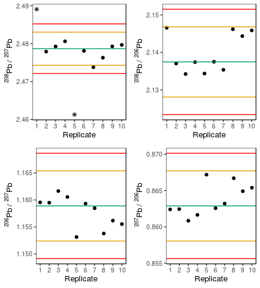
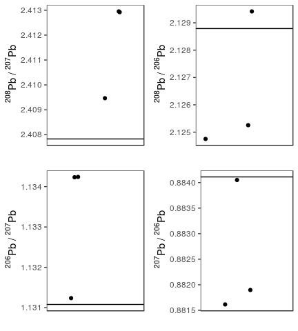
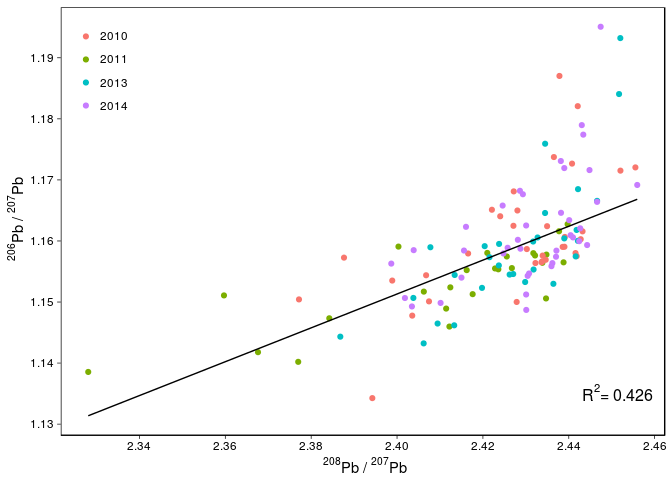
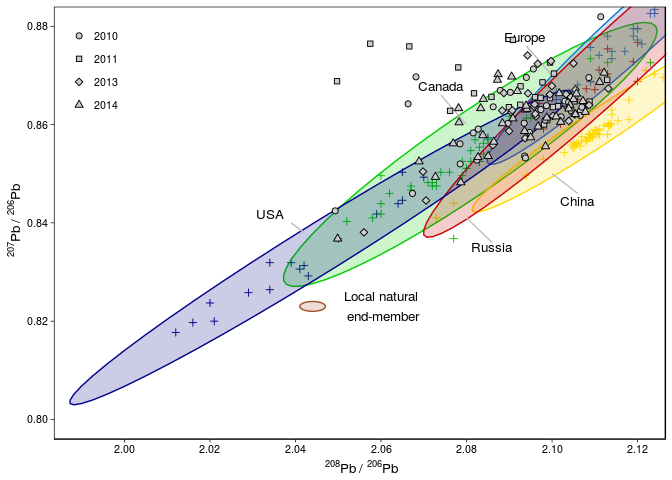

The pbratios package
================
Andrea Bazzano
2017-03-20

The package `pbratios` provides a set of R functions to efficiently extract, process and visually inspect Pb isotope ratio data from csv reports generated by the Perkin Elmer ELAN ICP-MS instrument. This package is currently under test.

Functions to modify the data
============================

Get the raw intensities and ratios by `extract_data`
----------------------------------------------------

The function `extract_data` is used to gather the sample names and the intensities measured for each nuclide and present them in a tidy table. The function is compatible with two different types of report: *short* and *long*.

-   *short* reports have only information about the sample ID, the time at which the analysis ended, a summary with average intensities and then the intensity values for each replicate. An example of this report is `sednya_2015.csv` and it can be accessed with the following code.

``` r
file.short <- system.file("extdata", "sednya_2015.csv", package = "pbratios")
```

-   *long* reports contain additional information about the measurement conditions, whereas the summary section is at the end of the intensity values for each replicates. These reports are usually produced when working in isotope ratio mode. An example of this report is `spmnya_2012.csv` and it can be accessed with the following code.

``` r
file.long <- system.file("extdata", "spmnya_2012.csv", package = "pbratios")
```

When using the function `extract_data`, the first argument is the path for the csv file whereas the argument `report` need to be equal either to `"short"` or `"long"` depending on the type of csv file generated by the instrument.

Standard reference material used for standard bracketing must be labelled as "SRM" and quality control (QC) samples as "CRM". The function will append a progressive integer to these names.

The output of the function is a table where each row represents a replicate and columns gather the intensities for each measured nuclides. Raw **<sup>20*x*</sup>*P**b*/<sup>20*y*</sup>*P**b* ratios are also displayed, where *x*, *y* = 6, 7, 8. These Pb isotope ratio still need to be filtered for possible outliers, summarised and corrected for instrumental mass bias.

A typical output is given by

``` r
library(pbratios)
spmnya <- extract_data(file.long, report = "long")
head(spmnya)
```

    ##      sample   Pb206   Pb207   Pb208 Pb208207 Pb206207 Pb208206  Pb207206
    ## 1: SRM981_1 1624078 1496348 3571385 2.386734 1.085361 2.199023 0.9213524
    ## 2: SRM981_1 1583811 1461639 3493060 2.389825 1.083586 2.205477 0.9228615
    ## 3: SRM981_1 1583666 1458370 3473160 2.381537 1.085916 2.193114 0.9208820
    ## 4: SRM981_1 1569359 1445388 3447488 2.385164 1.085770 2.196749 0.9210054
    ## 5: SRM981_1 1572977 1450444 3464123 2.388318 1.084479 2.202272 0.9221014
    ## 6: SRM981_1 1537003 1411263 3368303 2.386729 1.089098 2.191474 0.9181914

Remove possible outliers and summarise ratios by `calc_ratios`
--------------------------------------------------------------

The output from the function `extract_data` can be inspected for outliers by using the function `calc_ratios`. Possible outliers are defined as those ratios exceeding the *m**e**d**i**a**n* ± 2.5 *m**a**d* range and are automatically removed from the data set Leys et al. (2013). Only about 5 % of the data is removed. A table with the number of outliers removed for each sample is printed on screen.

The data set is then summarised keeping only average ratios and standard errors for each sample.

``` r
spmnya.ratios <- calc_ratios(spmnya)
head(spmnya.ratios)
```

    ##      sample Pb208207  Pb208207.se Pb206207  Pb206207.se Pb208206
    ## 1: SRM981_1 2.386274 0.0008054860 1.085609 0.0004889660 2.198007
    ## 2:  GB13-12 2.471069 0.0029953700 1.175741 0.0010564343 2.101726
    ## 3:  GB38-12 2.474355 0.0056726204 1.168955 0.0031574660 2.106440
    ## 4: SRM981_2 2.391624 0.0008234481 1.086210 0.0002060891 2.202768
    ## 5: SRM981_3 2.392367 0.0007294441 1.084165 0.0002529351 2.208466
    ## 6:      AC1 2.442976 0.0029724271 1.146744 0.0027210591 2.134048
    ##     Pb208206.se  Pb207206  Pb207206.se
    ## 1: 0.0009288434 0.9211432 0.0004143127
    ## 2: 0.0012203516 0.8505324 0.0007627050
    ## 3: 0.0053561758 0.8530488 0.0032136625
    ## 4: 0.0008326900 0.9206323 0.0001746594
    ## 5: 0.0007593043 0.9223693 0.0002152606
    ## 6: 0.0035043141 0.8720787 0.0020681339

These ratios still need to be corrected for mass bias before being interpreted.

Standard bracketing for mass bias correction using `corr_mbf`
-------------------------------------------------------------

Isotope ratios can be corrected for instrumental mass bias using several approaches. The function `corr_mbf` implements the standard bracketing only.

To use the `corr_mbf` function, standards for bracketing must be labelled as "SRM". These are diluted solutions of NIST SRM 981 with certified Pb isotope ratios. Pb isotope ratios measured in SRM solutions immediately before and after a set of samples (usually 3 or 4) are divided for their certified values and averaged. The result is the mass bias factor (*k*) that has to be applied to raw Pb isotope ratios (*r*) measured in samples analysed within the two bracketing standards. The corrected Pb isotope ratios (*R*) are then easily calculated using the following equation:
*R* = *r*/*k*

The function subset the data set to start and end with bracketing standards, any samples before or after the first or last SRM is ignored.

`corr_mbf` can be used directly on the output of `calc_ratios` and returns a table containing the corrected **<sup>20*x*</sup>*P**b*/<sup>20*y*</sup>*P**b* ratios with their extended uncertainties (*U* = *k* *u*, *k* = 2).

``` r
spmnya.corr <- corr_mbf(spmnya.ratios)
knitr::kable(head(spmnya.corr), digits = 4, pad = 0)
```

| sample  | Pb208207 | Pb208207.U | Pb206207 | Pb206207.U | Pb208206 | Pb208206.U | Pb207206 | Pb207206.U |
|:--------|----------|------------|----------|------------|----------|------------|----------|------------|
| GB13-12 | 2.4519   | 0.0062     | 1.1838   | 0.0023     | 2.0709   | 0.0030     | 0.8448   | 0.0016     |
| GB38-12 | 2.4552   | 0.0115     | 1.1769   | 0.0064     | 2.0755   | 0.0109     | 0.8473   | 0.0065     |
| AC1     | 2.4183   | 0.0061     | 1.1565   | 0.0055     | 2.0938   | 0.0072     | 0.8647   | 0.0042     |
| AC2     | 2.4376   | 0.0049     | 1.1644   | 0.0040     | 2.0905   | 0.0076     | 0.8589   | 0.0030     |
| AC3     | 2.3990   | 0.0137     | 1.1424   | 0.0046     | 2.0987   | 0.0142     | 0.8754   | 0.0036     |
| AC4     | 2.4256   | 0.0149     | 1.1717   | 0.0090     | 2.0738   | 0.0150     | 0.8536   | 0.0066     |

The three functions presented so far can be combined conveniently using the *pipe* operator `%>%` provided by the package `dplyr`:

``` r
file.long <- system.file("extdata", "spmnya_2012.csv", package = "pbratios")
spmnya <- file.long %>% 
          extract_data(report = "long") %>% 
          calc_ratios %>% 
          corr_mbf
head(spmnya)
```

The function `all_ratios` does exactly the same but require less typing.

``` r
file.long <- system.file("extdata", "spmnya_2012.csv", package = "pbratios")
spmnya <- all_ratios(file.long, report = "long", print = TRUE)
```

Functions to plot and export Pb ratios
======================================

Visually inspect possbile outliers using `check_outliers`
---------------------------------------------------------

The function `calc_ratio` automatically remove possible outliers and print on screen the number of outliers for each sample. However, it can be useful to have more control on the possible outliers detected for each sample.

The function `check_outliers` can be useful to visually inspect samples with a suspicious number of outliers.

``` r
file.long %>%
  extract_data(report = "long") %>%
  check_outliers("II.B.50m")
```



The first argument is the output of the function `extract_data` and the second argument a string matching the name of the sample to be inspected.

The function produces a plot for each Pb isotope ratio: values for each replicate are represented as dots, whereas *m**e**d**i**a**n*, *m**e**d**i**a**n* ± 2 *m**a**d* and *m**e**d**i**a**n* ± 3 *m**a**d* are represented by solid green, yellow and red lines, respectively. Possible outliers lying outside the *m**e**d**i**a**n* ± 2.5 *m**a**d* are represented with the \* symbol. This approach is typically preferred to the approach based on the *m**e**a**n* ± 2 *s**d* criterion (Leys et al. 2013).

Additionally, raw intensities and Pb isotope ratios for the inspected sample are printed on screen.

Check the method performances with `qc_check`
---------------------------------------------

QC samples typically should have a matrix similar to the samples to be analysed and known values of the measurand. They are usually analysed between samples in order to asses and control the performances of the method.

The `qc_check` function subset the data set produced by the function `corr_mbf` so that it contains only "CRM" samples. Pb isotope ratios for these samples are then summarised graphically by plotting points or box-plots (for *n* &gt; 10). Data are stored in an R object and permil errors are calculated assuming the CRM to be BCR CRM 482 and using the Pb isotope ratio reference values provided by Cloquet, Carignan, and Libourel (2006).

``` r
qc.short <- file.short %>%
  all_ratios(report = "short", print = TRUE) %>%
  qc_check
```



The generated R object is a list containing Pb isotope ratios for each QC sample (first table) and some descriptive statistics for both ratios (second table) and permil errors (third table).

|  Pb208207|  Pb208207.U|  Pb206207|  Pb206207.U|  Pb208206|  Pb208206.U|  Pb207206|  Pb207206.U|
|---------:|-----------:|---------:|-----------:|---------:|-----------:|---------:|-----------:|
|    2.4129|      0.0091|    1.1342|      0.0043|    2.1252|      0.0079|    0.8816|      0.0034|
|    2.4095|      0.0102|    1.1312|      0.0027|    2.1293|      0.0072|    0.8840|      0.0021|
|    2.4130|      0.0071|    1.1342|      0.0032|    2.1249|      0.0068|    0.8819|      0.0026|

|        |  Pb208207|  Pb206207|  Pb208206|  Pb207206|
|--------|---------:|---------:|---------:|---------:|
| Mean   |    2.4118|    1.1332|    2.1265|    0.8825|
| Median |    2.4129|    1.1342|    2.1252|    0.8819|
| SD     |    0.0020|    0.0017|    0.0025|    0.0013|
| CI95   |    0.0029|    0.0025|    0.0036|    0.0018|
| RSD    |    0.0836|    0.1528|    0.1173|    0.1453|
| Min    |    2.4095|    1.1312|    2.1249|    0.8816|
| Max    |    2.4130|    1.1342|    2.1293|    0.8840|
| N      |    3.0000|    3.0000|    3.0000|    3.0000|

|        |  Pb208207|  Pb206207|  Pb208206|  Pb207206|
|--------|---------:|---------:|---------:|---------:|
| Mean   |      1.64|      1.91|     -1.09|     -1.81|
| Median |      2.12|      2.79|     -1.69|     -2.48|
| SD     |      0.84|      1.53|      1.17|      1.45|
| CI95   |      1.20|      2.20|      1.68|      2.08|
| RMSE   |      0.68|      1.25|      0.96|      1.18|
| Min    |      0.67|      0.14|     -1.84|     -2.81|
| Max    |      2.13|      2.79|      0.26|     -0.15|

Three isotope plots with `isoplot_generic` and `isoplot.pm10`
-------------------------------------------------------------

Three isotope plots are useful tools for the interpretation of variations in Pb isotope ratios.

The function `isoplot.generic` can plot Pb isotope ratio values in a three-isotope space defined by the user. Additionally, data points can be differentiated by colors specifying a factor, whereas a line calculated with robust regression can be plotted on top of the data.

The function `isoplot.pm10` is specifically designed for PM10 data collected in the Northern Hemisphere and allows the comparison of measured values with literature values (additional information are provided in [section 3.2](#sec3.2). Data points can be differentiated providing a factor but the three-isotope space is defined with **<sup>208</sup>*P**b*/<sup>206</sup>*P**b* as *x* and **<sup>207</sup>*P**b*/<sup>206</sup>*P**b* as *y*.

``` r
data(pm10nya)
# remove QC samples
pm10.smp <- pm10nya[-grep("CRM", sample)]
# generate a factor year from sample names
year <- paste0("20", gsub("[[:alpha:]]+[0-9]{1,2}." , "", pm10.smp$sample))
year[grep("20-10", year)] <- "2010"
year <- as.factor(year)
year <- droplevels(year)
pm10.smp[, year := year]

isoplot_generic(pm10.smp, x = "Pb208207", y = "Pb206207", factor = "year", regression = TRUE)
isoplot_pm10(pm10.smp, factor = "year")
```



Using the `data.table` syntax is possible to filter the data to be plotted, for examples considering only samples with small uncertainties.

``` r
isoplot_pm10(pm10.smp[Pb208206.U < 0.01], factor = "year")
```

Both `isoplot` functions save a pdf, png and svg copies of the plot in the folder "output".

Export data with `save_table`
-----------------------------

This function is a shortcut for the function `write.csv2` and allows to save the data in a csv file in the "output" folder. File name is derived from the R object in the first argument of the function:

``` r
save_table(pm10.smp)
```

creates a file with the name "pm10smp.csv" in the "output" folder.

Dataset for Pb isotope ratios
=============================

Raw reports
-----------

The package `pbratios` includes two examples of csv reports generated by the instrument Perkin Elmer Elan ICP-MS: `spmnya_2012.csv` and `sednya_2015.csv` are in "long" and "short" format, respectively. They can be accessed by running the following code.

``` r
file.long <- system.file("extdata", "spmnya_2012.csv", package = "pbratios")
file.short <- system.file("extdata", "sednya_2015.csv", package = "pbratios")
```

These data set contain raw Pb isotope ratio measured in marine suspended particulate matter and size-fractionated sediments in the marine coastal environment of the Kongsfjorden. Data were published in Bazzano et al. (2014) and Grotti et al. (2017).

Corrected Pb isotope ratios
---------------------------

The `pm10nya` data set contains Pb isotope ratio data measured in PM10 samples collected from 2010 to 2014 at Ny-Ålesund (Svalbard, Norwegian Arctic) and can be accessed running `data(pm10nya)`. Pb isotope ratio values were published in Bazzano et al. (2016).

The `pm10nh` data set contains Pb isotope ratio data measured by several research group in PM10 samples collected in industrialised region on the Northern Hemisphere. This data set can be accessed by `data(pm10nh)` and it is used internally by the function `isoplot_pm10` to generate confidence ellipses for different geographical areas. Data were obtained from Zhu et al. (2010), Carignan, Simonetti, and Gariépy (2002), Bollhöfer and Rosman (2001), Mukai, Tanaka, et al. (2001) and Mukai, Machida, et al. (2001).

References
----------

Bazzano, A., P. Rivaro, F. Soggia, F. Ardini, and M. Grotti. 2014. “Anthropogenic and Natural Sources of Particulate Trace Elements in the Coastal Marine Environment of Kongsfjorden, Svalbard.” *Mar. Chem.* 163 (July): 28–35. doi:[10.1016/j.marchem.2014.04.001](https://doi.org/10.1016/j.marchem.2014.04.001).

Bazzano, Andrea, David Cappelletti, Roberto Udisti, and Marco Grotti. 2016. “Long-Range Transport of Atmospheric Lead Reaching Ny-ålesund: Inter-Annual and Seasonal Variations of Potential Source Areas.” *Atmospheric Environment* 139 (August): 11–19. doi:[10.1016/j.atmosenv.2016.05.026](https://doi.org/10.1016/j.atmosenv.2016.05.026).

Bollhöfer, A, and K J R Rosman. 2001. “Isotopic Source Signatures for Atmospheric Lead: The Northern Hemisphere.” *Geochim. Cosmochim. Acta* 65 (11): 1727–40. doi:[10.1016/S0016-7037(00)00630-X](https://doi.org/10.1016/S0016-7037(00)00630-X).

Carignan, J, A Simonetti, and C Gariépy. 2002. “Dispersal of Atmospheric Lead in Northeastern North America as Recorded by Epiphytic Lichens.” *Atmos. Environ.* 36 (23): 3759–66. doi:[10.1016/S1352-2310(02)00294-7](https://doi.org/10.1016/S1352-2310(02)00294-7).

Cloquet, Christophe, Jean Carignan, and Guy Libourel. 2006. “Atmospheric Pollutant Dispersion Around an Urban Area Using Trace Metal Concentrations and Pb Isotopic Compositions in Epiphytic Lichens.” *Atmos. Environ.* 40 (3): 574–87. doi:[10.1016/j.atmosenv.2005.09.073](https://doi.org/10.1016/j.atmosenv.2005.09.073).

Grotti, Marco, Francesco Soggia, Francisco Ardini, Andrea Bazzano, Beatrice Moroni, Riccardo Vivani, David Cappelletti, and Cristina Misic. 2017. “Trace Elements in Surface Sediments from Kongsfjorden, Svalbard: Occurrence, Sources and Bioavailability.” *International Journal of Environmental Analytical Chemistry*, submitted.

Leys, Christophe, Christophe Ley, Olivier Klein, Philippe Bernard, and Laurent Licata. 2013. “Detecting Outliers: Do Not Use Standard Deviation Around the Mean, Use Absolute Deviation Around the Median.” *Journal of Experimental Social Psychology* 49 (4): 764–66. doi:[http://dx.doi.org/10.1016/j.jesp.2013.03.013](https://doi.org/http://dx.doi.org/10.1016/j.jesp.2013.03.013).

Mukai, Hitoshi, Toshinobu Machida, Atsushi Tanaka, Yelpatievskiy Pavel Vera, and Mitsuo Uematsu. 2001. “Lead Isotope Ratios in the Urban Air of Eastern and Central Russia.” *Atmos. Environ.* 35 (15): 2783–93. doi:[10.1016/S1352-2310(00)00341-1](https://doi.org/10.1016/S1352-2310(00)00341-1).

Mukai, Hitoshi, Atsushi Tanaka, Toshihiro Fujii, Yiqiang Zeng, Yetang Hong, Jie Tang, Song Guo, et al. 2001. “Regional Characteristics of Sulfur and Lead Isotope Ratios in the Atmosphere at Several Chinese Urban Sites.” *Environ. Sci. Technol.* 35 (6): 1064–71. doi:[10.1021/es001399u](https://doi.org/10.1021/es001399u).

Zhu, Laimin, Jianwu Tang, Ben Lee, Yu Zhang, and Feifei Zhang. 2010. “Lead Concentrations and Isotopes in Aerosols from Xiamen, China.” *Mar. Pollut. Bull.* 60 (11): 1946–55. doi:[10.1016/j.marpolbul.2010.07.035](https://doi.org/10.1016/j.marpolbul.2010.07.035).
